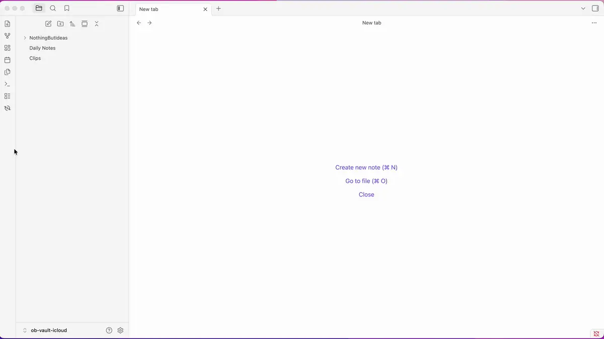

# X Bookmarks Sync — Obsidian Plugin

Sync your X (Twitter) bookmarks directly into your Obsidian vault as clean, structured Markdown notes. No API key. No OAuth. Just your existing browser session.



---

## What's new in 1.1.1

- **Security patches** — upgraded bundled `defuddle` to 0.18.x (which transitively patches `@xmldom/xmldom`) and `esbuild` to 0.28.x, plus npm overrides for `fast-uri` and `picomatch`. Clears all open Dependabot advisories.

## What's new in 1.1.0

- **Import X article body** — pull the full body of a bookmarked X long-form article into its note and rename the file to the article title. Right-click in the note, command palette, or toolbar button while viewing the article.
- **Long tweets imported in full** — premium long-form posts (`note_tweet`) are no longer truncated at the visible "Show more" cutoff.
- **Images embedded** — photo attachments on bookmarked tweets now appear in the note as Markdown image links to the X CDN.
- **Re-import a single bookmark** — refresh one note's content on the next sync without clearing your entire import history.
- **Toolbar restructured** — new **Import article** button on `/status/` and `/article/` pages; **Copy main content** (replaces "Copy as Markdown") now strips replies and thread context.

---

## Features

- **No API key required** — works by scraping the loaded page via an embedded webview; piggybacks on your existing X session
- **Selective import** — choose exactly which bookmarks to save from a checklist modal
- **Incremental sync** — "Sync from last" mode scrolls only until it reaches already-imported bookmarks, so large libraries stay fast
- **Duplicate detection** — already-imported bookmarks are grayed out and skipped automatically
- **Long tweets supported** — premium long-form posts are imported in full, not truncated at the visible "Show more" cutoff
- **Images embedded** — photo attachments on bookmarked tweets are saved as Markdown image links to the X CDN
- **Import X article body** — for tweets that are native X long-form articles, fetch the full article body into the note and rename the file to the article title (right-click in note, command palette, or toolbar button while viewing the article)
- **Re-import on next sync** — delete a single bookmark from history with one click and have it re-imported on the next sync
- **Copy main content** — clipboard-copy the focal tweet/article from the webview, replies stripped, powered by [Defuddle](https://github.com/kepano/defuddle)
- **Configurable folder & tags** — set where notes land and what tags are applied in plugin settings
- **Structured Markdown notes** — each bookmark is saved with YAML frontmatter (id, author, url, tags, date)
- **Deep-link back** — each note includes an `obsidian://` link to re-open the tweet in the webview

> **Desktop only.** This plugin uses Electron's `<webview>` tag, which is not available in Obsidian mobile.

---

## Usage

### Syncing bookmarks

1. Click the **X Bookmarks Sync icon** in the Obsidian ribbon (or run the command **Open X Bookmarks View**).
2. A side panel opens with X.com loaded. Log in to your account if prompted.
3. Navigate to your **Bookmarks page**.
4. Click **Extract Bookmarks** in the panel toolbar. The plugin will automatically scroll through your bookmarks to collect them.
5. A selection modal appears listing all visible bookmarks. New ones are pre-checked; already-imported ones are grayed out.
6. Check or uncheck as needed, then click **Import Selected**.
7. Notes appear in your configured bookmarks folder (default: `x-bookmarks/`).

### Sync from last (incremental mode)

Check **Sync from last** in the toolbar before clicking **Extract Bookmarks**. The plugin will automatically stop scrolling once it encounters a bookmark that has already been imported — ideal for regular top-up syncs without traversing your entire history.

> **First sync:** The checkbox is unchecked by default until you have completed at least one full sync. This ensures your entire bookmark history is captured on the first run.

### Import X article body


For bookmarks that point at native X long-form articles (URLs like `x.com/<user>/status/<id>` rendered as an Article), the plugin can pull the full article body into the note. Three entry points:

- **In the note** — right-click in the editor of a bookmark note → **Import X article body**.
- **From the command palette** — **Import X article body to current note**.
- **From the webview** — open the tweet via its `obsidian://` link; while on a `/status/` or `/article/` page, click **Import article** in the toolbar. The plugin finds the matching bookmark note by id, fetches the article in a hidden background webview, appends the body under a **`## Full article`** heading, and renames the file to the article's title (keeping the `{date}-{author}-` prefix).

If the bookmarked tweet isn't actually an article, the plugin shows a Notice and skips the import — no replies or unrelated content get pulled in.

### Re-import a bookmark

Need to refresh a single note (for example, you imported it before long-tweet support landed)? Right-click in the note's editor → **Re-import this bookmark on next sync** (also in the command palette). The plugin removes the tweet id from import history and moves the file to the system trash; on the next sync the bookmark appears as new in the selection modal.


### Copy main content

While viewing any X page in the webview, click **Copy main content** in the toolbar to copy the focal tweet or article as Markdown to your clipboard. Replies and surrounding thread context are stripped automatically — you get just the post you opened.

---

## Commands & menu items reference

| Action | Right-click in bookmark note | Command palette | Toolbar button (X bookmarks view) |
|---|---|---|---|
| Open the X bookmarks view | — | **Open X bookmarks view** | — |
| Sync bookmarks from the bookmarks page | — | — | **Extract bookmarks** (visible on `/i/bookmarks`) |
| Copy the focal tweet/article to clipboard | — | — | **Copy main content** (visible on any non-bookmarks X page) |
| Import the article body into the bookmark note | **Import X article body** | **Import X article body to current note** | **Import article** (visible on `/status/` or `/article/` pages) |
| Re-import a single bookmark on the next sync | **Re-import this bookmark on next sync** | **Re-import this bookmark on next sync** | — |

The right-click menu items only appear on bookmark notes — that is, notes whose YAML frontmatter contains an X URL (`url:` or `article_url:`).

---

## Settings

Open **Settings → X Bookmarks Sync** to configure:


| Setting | Description | Default |
|---|---|---|
| **Default folder** | Vault folder where bookmark notes are saved | `x-bookmarks` |
| **Default tags** | Tags applied to every imported note (chip UI — press Enter to add) | `twitter`, `bookmark` |
| **Last sync** | Timestamp of the most recent successful import (read-only) | — |
| **Clear import history** | Removes all tracked import IDs, allowing previously imported bookmarks to be re-imported | — |

> **Note on Clear import history:** This resets all record of previously imported bookmarks. On the next sync, everything will be treated as new. Use this if you want to start fresh or re-import after cleaning up your vault.

---

## Installation

### From Obsidian's Community Plugins (recommended)

1. Open **Settings → Community plugins**.
2. Make sure **Restricted mode** is **off**.
3. Click **Browse** and search for **X Bookmarks Sync**.
4. Click **Install**, then **Enable**.

### Via BRAT (for pre-release versions)

Use this if you want early access to fixes or features that haven't been published to the community store yet.

1. Install the [BRAT plugin](https://github.com/TfTHacker/obsidian42-brat) from the Obsidian community plugins list.
2. In BRAT settings, click **Add Beta Plugin** and enter:
   ```
   hfknight/x-bookmarks-sync
   ```
3. Enable **X Bookmarks Sync** in **Settings → Community plugins**.

### Manual

1. Download the latest `x-bookmarks-sync.zip` from the [Releases page](../../releases).
2. Extract the zip — you'll get `main.js` and `manifest.json`.
3. In your vault, navigate to `.obsidian/plugins/` (create the folder if it doesn't exist).
4. Create a new subfolder named `x-bookmarks-sync`.
5. Place `main.js` and `manifest.json` inside it.
6. Restart Obsidian, then go to **Settings → Community plugins** and enable **X Bookmarks Sync**.

### From source

```bash
git clone https://github.com/hfknight/x-bookmarks-sync
cd x-bookmarks-sync
npm install
npm run build:plugin
```

Copy `obsidian-plugin/main.js` and `obsidian-plugin/manifest.json` into `.obsidian/plugins/x-bookmarks-sync/` in your vault.

---

## Note Format

Each saved bookmark becomes a Markdown file. Optional sections are added when the bookmark contains an article card, photos, or has had its article body imported.

```markdown
---
id: "1234567890"
author: "Display Name"
username: "@handle"
scraped_date: 2024-01-15
url: "https://x.com/handle/status/1234567890"
article_url: "https://x.com/handle/article/1234567890"   # only if the tweet links to an X article
tags: [twitter, bookmark]
---

# Tweet by Display Name (@handle)

The full text of the tweet goes here...


## Linked article            # only if the tweet contains an X article card

**Article title here**

Short excerpt rendered in the card…

[Read full article](https://x.com/...)

[View on X](https://x.com/...) | [Open in Obsidian Webview](obsidian://x-bookmarks?url=...)

## Full article              # added by Import X article body
…full Defuddle-extracted article body…
```

**File naming:** `{folder}/{YYYY-MM-DD}-{author}-{first 40 chars of tweet}.md`. After **Import X article body** runs, the title segment is replaced with the article's actual title (sanitized, truncated to 40 chars); the date and author prefix are preserved.

---

## Limitations

- **Desktop only** — requires Electron's `<webview>` tag, not available in Obsidian mobile.
- **Subject to X.com DOM changes** — if X changes their markup, the scraper selectors may need updating.
- **Videos & GIFs not imported** — only photos are embedded; for videos/GIFs the note links back to X. Future work.
- **CDN-hosted images** — embedded images reference X's CDN (`pbs.twimg.com`). If X removes the image, the link in your note breaks. Local-download support is planned.
- **Existing notes don't backfill new fields** — when you upgrade and gain new features (like long-tweet text or image embedding), already-imported notes stay as they were. Use **Re-import this bookmark on next sync** to refresh individual notes, or **Clear import history** to wipe everything and re-sync.

---

## License

MIT
