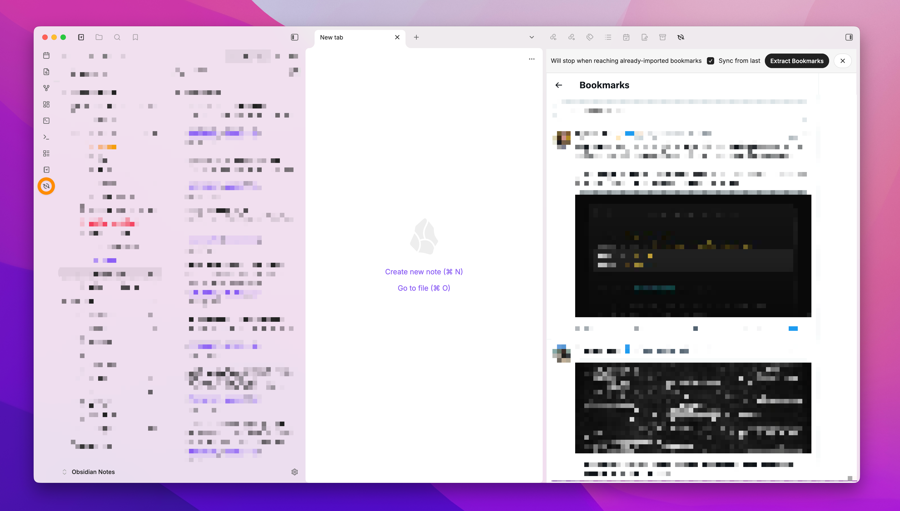
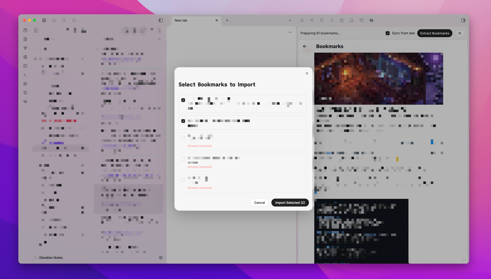
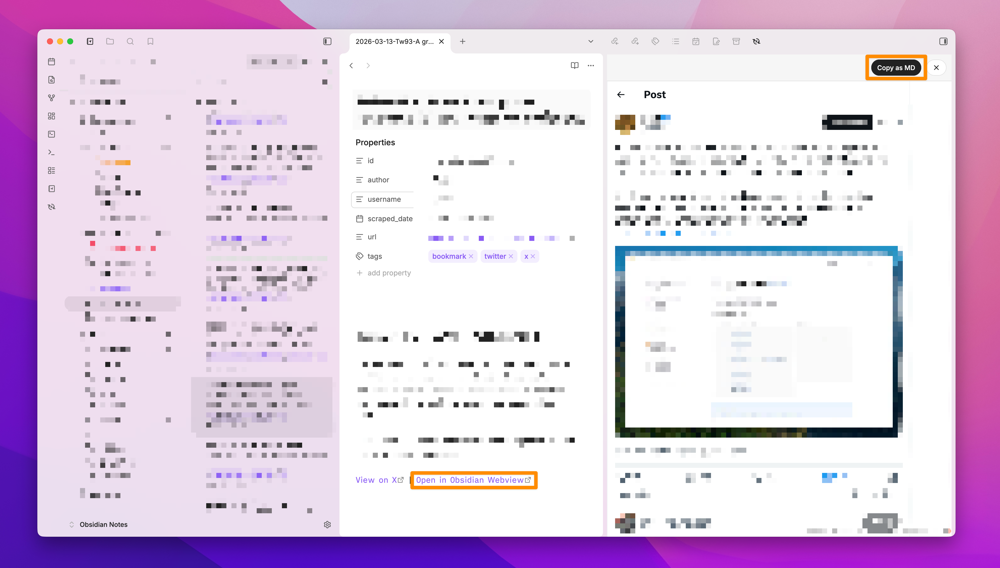
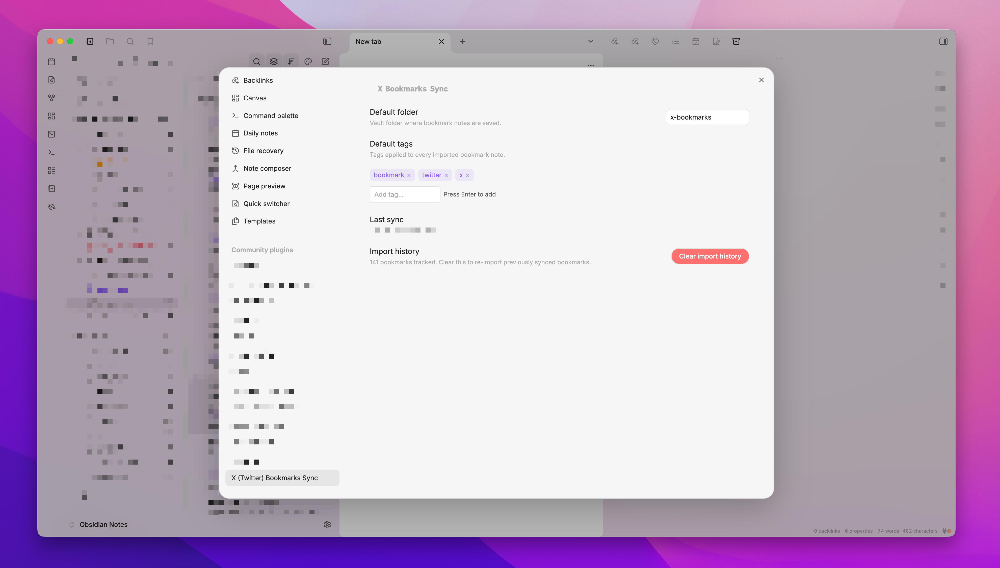

# X Bookmarks Sync — Obsidian Plugin

Sync your X (Twitter) bookmarks directly into your Obsidian vault as clean, structured Markdown notes. No API key. No OAuth. Just your existing browser session.



---

## Features

- **No API key required** — works by scraping the loaded page via an embedded webview; piggybacks on your existing X session
- **Selective import** — choose exactly which bookmarks to save from a checklist modal
- **Incremental sync** — "Sync from last" mode scrolls only until it reaches already-imported bookmarks, so large libraries stay fast
- **Duplicate detection** — already-imported bookmarks are grayed out and skipped automatically
- **Configurable folder & tags** — set where notes land and what tags are applied in plugin settings
- **Structured Markdown notes** — each bookmark is saved with YAML frontmatter (id, author, url, tags, date)
- **Deep-link back** — each note includes an `obsidian://` link to re-open the tweet in the webview
- **Copy as Markdown** — while viewing any tweet or article in the webview, extract and copy its content as Markdown (powered by [Defuddle](https://github.com/kepano/defuddle)), useful when you bookmarked an X article

> **Desktop only.** This plugin uses Electron's `<webview>` tag, which is not available in Obsidian mobile.

---

## Installation

### Via BRAT (recommended for early access)

1. Install the [BRAT plugin](https://github.com/TfTHacker/obsidian42-brat) from the Obsidian community plugins list.
2. In BRAT settings, click **Add Beta Plugin** and enter:
   ```
   hfknight/x-bookmarks-sync
   ```
3. Enable **X Bookmarks Sync** in **Settings → Community Plugins**.

### Manual

1. Download the latest `x-bookmarks-sync.zip` from the [Releases page](../../releases).
2. Extract the zip — you'll get `main.js` and `manifest.json`.
3. In your vault, navigate to `.obsidian/plugins/` (create the folder if it doesn't exist).
4. Create a new subfolder named `x-bookmarks-sync`.
5. Place `main.js` and `manifest.json` inside it.
6. Restart Obsidian, then go to **Settings → Community Plugins** and enable **X Bookmarks Sync**.

### From source

```bash
git clone https://github.com/hfknight/x-bookmarks-sync
cd x-bookmarks-sync
npm install
npm run build:plugin
```

Copy `obsidian-plugin/main.js` and `obsidian-plugin/manifest.json` into `.obsidian/plugins/x-bookmarks-sync/` in your vault.

---

## Usage

### Syncing bookmarks

1. Click the **X Bookmarks Sync icon** in the Obsidian ribbon (or run the command **Open X Bookmarks View**).
2. A side panel opens with X.com loaded. Log in to your account if prompted.
3. Navigate to your **Bookmarks page**.
4. Click **Extract Bookmarks** in the panel toolbar. The plugin will automatically scroll through your bookmarks to collect them.

<!-- screenshot: toolbar — add docs/assets/Toolbar.png when available -->

5. A selection modal appears listing all visible bookmarks. New ones are pre-checked; already-imported ones are grayed out.



6. Check or uncheck as needed, then click **Import Selected**.
7. Notes appear in your configured bookmarks folder (default: `x-bookmarks/`).

### Sync from last (incremental mode)

Check **Sync from last** in the toolbar before clicking **Extract Bookmarks**. The plugin will automatically stop scrolling once it encounters a bookmark that has already been imported — ideal for regular top-up syncs without traversing your entire history.

> **First sync:** The checkbox is unchecked by default until you have completed at least one full sync. This ensures your entire bookmark history is captured on the first run.

### Copy as Markdown

While browsing any page in the webview, click **Copy as MD** to extract and copy the content as Markdown to your clipboard.

This is especially handy when a bookmark links to an article or long-form post. Use the **Open in Obsidian Webview** link at the bottom of a saved note to open the linked page, then click **Copy as MD** to capture the full article content. Paste it directly into your note in Obsidian for a complete, annotatable record.



---

## Settings

Open **Settings → X Bookmarks Sync** to configure:



| Setting | Description | Default |
|---|---|---|
| **Default folder** | Vault folder where bookmark notes are saved | `x-bookmarks` |
| **Default tags** | Tags applied to every imported note (chip UI — press Enter to add) | `twitter`, `bookmark` |
| **Last sync** | Timestamp of the most recent successful import (read-only) | — |
| **Clear import history** | Removes all tracked import IDs, allowing previously imported bookmarks to be re-imported | — |

> **Note on Clear import history:** This resets all record of previously imported bookmarks. On the next sync, everything will be treated as new. Use this if you want to start fresh or re-import after cleaning up your vault.

---

## Note Format

Each saved bookmark becomes a Markdown file with this structure:

```markdown
---
id: "1234567890"
author: "Display Name"
username: "@handle"
scraped_date: 2024-01-15
url: "https://x.com/handle/status/1234567890"
tags: [twitter, bookmark]
---

# Tweet by Display Name (@handle)

The full text of the tweet goes here...

[View on X](https://x.com/...) | [Open in Obsidian Webview](obsidian://x-bookmarks?url=...)
```

**File naming:** `{folder}/{YYYY-MM-DD}-{author}-{first 40 chars of tweet}.md`

---

## Limitations

- **Desktop only** — requires Electron's `<webview>` tag, not available in Obsidian mobile.
- **Subject to X.com DOM changes** — if X changes their markup, the scraper selectors may need updating.
- **Deleted notes are not re-synced automatically** — if you delete a note from your vault, it won't be re-imported unless you clear the import history. As a workaround, delete all notes in your bookmarks folder, go to **Settings → X Bookmarks Sync → Clear import history**, then run a full sync. (A smarter per-note re-sync is planned.)

---

## License

MIT
